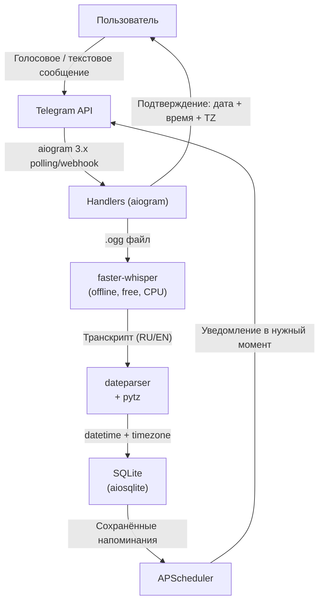

# ReminderTelegramBot — RoadMap

## Архитектура бота



**Стек:**
- **aiogram 3.x** — async Telegram framework (polling + webhook)
- **faster-whisper** — offline STT, модель `small`, поддержка русского, без API ключей
- **dateparser** — парсинг русских дат: "завтра в 3", "через 2 часа", "15 мая в 10 утра"
- **APScheduler** — планировщик напоминаний
- **aiosqlite** — хранение напоминаний и таймзон пользователей
- **pydub + ffmpeg** — конвертация .ogg → .wav для Whisper

## Структура проекта

```
ReminderTelegramBot/
├── bot/
│   ├── main.py              # polling/webhook toggle через .env
│   ├── config.py            # Settings from .env
│   ├── handlers/
│   │   ├── start.py         # /start, /help, /timezone
│   │   ├── voice.py         # голосовые сообщения
│   │   └── text.py          # текстовые напоминания
│   ├── services/
│   │   ├── stt.py           # faster-whisper pipeline
│   │   ├── nlp.py           # dateparser datetime extraction
│   │   └── scheduler.py     # APScheduler + уведомления
│   └── database/
│       └── models.py        # reminders + user_timezones tables
├── .env.example
├── .gitignore
├── requirements.txt
└── README.md
```

## Форматы голосовых напоминаний (поддерживаемые фразы)

- "Напомни мне завтра в 15:00 про встречу"
- "Поставь напоминание через 2 часа — позвонить маме"
- "15 мая в 10 утра — сдать отчёт"
- "Каждый день в 9 утра пить таблетки"

## Шаг 1 — Cursor Rules (`.cursor/rules/`)

Создать три правила прежде чем писать код:

- [`python-async.mdc`](.cursor/rules/python-async.mdc) — `alwaysApply: false`, glob `**/*.py` — паттерны async/await aiogram, запрет blocking calls
- [`bot-security.mdc`](.cursor/rules/bot-security.mdc) — `alwaysApply: true` — токены только из `.env`, `.env` в `.gitignore`, no hardcoded secrets
- [`project-conventions.mdc`](.cursor/rules/project-conventions.mdc) — `alwaysApply: true` — структура проекта, именование модулей, logging стандарт

## Шаг 2 — Cursor Skills (`.cursor/skills/`)

Создать два специализированных скилла:

- `.cursor/skills/faster-whisper-stt/SKILL.md` — загрузка модели, конвертация .ogg→.wav через pydub, транскрипция, кэширование модели в singleton
- `.cursor/skills/dateparser-nlp/SKILL.md` — парсинг русских дат, `settings={'PREFER_DATES_FROM': 'future', 'RETURN_AS_TIMEZONE_AWARE': True}`, обработка относительных дат, fallback при ошибке

## Шаг 3 — Cursor Subagents (`.cursor/agents/`)

Пять специализированных агентов, каждый владеет своей зоной:

- `reminder-bot-core.md` — строит `config.py`, `main.py`, `handlers/start.py`, `.env.example`, `.gitignore`, `requirements.txt`
- `stt-voice-specialist.md` — реализует `services/stt.py` + `handlers/voice.py`, использует skill `faster-whisper-stt`
- `nlp-datetime-specialist.md` — реализует `services/nlp.py` с dateparser, использует skill `dateparser-nlp`
- `scheduler-db-specialist.md` — реализует `database/models.py` + `services/scheduler.py` + APScheduler loop
- `webhook-deployer.md` — добавляет webhook режим в `main.py`, пишет `README.md` с полным гайдом деплоя

## Шаг 4 — Cursor Hooks (`.cursor/hooks/`)

Два хука как "клей" всего пайплайна:

- **`afterFileEdit` → `ruff-lint.sh`** — запускает `ruff check --fix` после каждого редактирования `.py` файла
- **`beforeShellExecution` → `check-env.sh`** — проверяет наличие `.env` перед `python bot/main.py`, предупреждает если файл отсутствует

## Порядок выполнения (Agent RoadMap)

```
[Rules] → [Skills] → [Subagent: core] → [Subagent: stt] → [Subagent: nlp]
    → [Subagent: scheduler-db] → [Subagent: webhook] → [Hooks активны везде]
```

Hooks работают на протяжении всего процесса: линтер запускается после каждого edit, проверка .env — перед каждым запуском бота.
